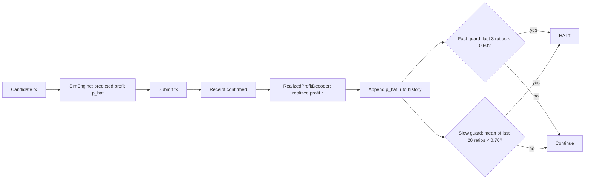

# Driftbrake: A Reconciliation-Based Halt Mechanism for Simulation-Driven Trading Strategies v0.1

**Date:** 2026-07-13
**Author(s):** Driftbrake project

## Abstract

Automated trading strategies that submit transactions based on an internal simulation — a REVM fork, a price model, an assumption about fill order — face a structural risk distinct from strategy failure: the simulation itself can drift from actual chain state, causing the strategy to keep submitting transactions that are confidently wrong, either reverting outright or succeeding for materially less profit than predicted. Because each individual transaction can look unremarkable in isolation, this drift is difficult to detect from log inspection alone and can silently erode capital over many trades. This document specifies Driftbrake's reconciliation mechanism: a pair of independent statistical guards that monitor the *relationship* between predicted and realized profit across a transaction history, rather than any single transaction's outcome, and halt the strategy when that relationship degrades beyond a configurable threshold. We state the mechanism's formal properties, including a correctness argument for the ratio-direction computation that a naive implementation is prone to inverting, and describe a benchmark methodology for selecting and validating guard thresholds against a given chain's volatility profile.

## 1. Motivation and background

Strategies that simulate before submitting — MEV searchers, liquidation bots, delta-neutral rebalancers — rely on the assumption that their local model of chain state at simulation time will still hold at execution time. This assumption breaks in three recurring ways, independent of strategy logic:

- **Stale price/state assumptions.** The simulation forks state at block $N$; by the time the transaction lands, state has advanced, and the profit that was true at $N$ is no longer true.
- **Fill-order assumptions.** A simulation that assumes a given ordering relative to other transactions in the mempool can be wrong about which venue fills first once transactions actually land.
- **Model-oracle drift.** Any off-chain price feed or model the simulation depends on can silently desynchronize from on-chain reality.

Existing REVM-based simulation tooling addresses the *forward* half of this problem well — running a candidate transaction against forked state efficiently and correctly. It does not, in general, address the *backward* half: verifying, after the fact and across many transactions, whether the forward simulation is still a trustworthy predictor of outcomes. A bot can have a correct simulation engine and still bleed capital if nothing is watching the gap between what it predicted and what happened.

Ad hoc responses to this gap are common and under-documented: teams add print statements, eyeball dashboards, or a single hardcoded "3 bad trades and stop" rule copied from wherever they last saw it fail. These ad hoc guards are rarely built with two properties this document argues are both necessary: sensitivity to a sudden severe break, and sensitivity to a slow, individually-forgivable bleed. A guard with only one of these properties is provably blind to the other failure shape, as argued in Section 4.

## 2. Design overview

Before any formal notation, the mechanism can be described in plain terms:

1. Before submitting a candidate transaction, the strategy runs it through a `SimEngine`, producing a **predicted profit** $\hat{p}$.
2. The transaction is submitted. Once confirmed, a `RealizedProfitDecoder` extracts the **realized profit** $r$, net of actual gas cost.
3. Each $(\hat{p}, r)$ pair is appended to a running history.
4. Two independent guards evaluate this history on every new pair:
   - A **fast guard**, sensitive to a short run of severely bad outcomes.
   - A **slow guard**, sensitive to a longer-run average drifting below an acceptable level.
5. If either guard trips, the strategy halts. Neither guard, on its own, is treated as sufficient — see Section 4 for why.

## 3. Notation

| Symbol | Meaning | Units |
|---|---|---|
| $\hat{p}_i$ | Predicted (simulated) profit for transaction $i$ | native token, smallest unit |
| $r_i$ | Realized profit for transaction $i$, net of gas | native token, smallest unit |
| $\rho_i$ | Realized-to-predicted ratio for transaction $i$ | dimensionless |
| $T_f$ | Fast-guard ratio threshold | dimensionless, default $0.50$ |
| $k_f$ | Fast-guard window size (consecutive transactions) | count, default $3$ |
| $T_s$ | Slow-guard mean-ratio threshold | dimensionless, default $0.70$ |
| $k_s$ | Slow-guard window size (rolling) | count, default $20$ |
| $H_n$ | History of the $n$ most recent $(\hat{p}_i, r_i)$ pairs | — |

## 4. Mechanism specification

### 4.1 Per-transaction ratio

For each confirmed transaction $i$ with predicted profit $\hat{p}_i > 0$:

$$\rho_i = \frac{r_i}{\hat{p}_i} \tag{1}$$

$\rho_i < 1$ indicates underperformance relative to prediction; $\rho_i \geq 1$ indicates the transaction realized at least as much profit as predicted (harmless, and in fact the common case when a simulation is conservative). The direction in Equation (1) is deliberate and is treated as a formal invariant in Section 5 — computing $\hat{p}_i / r_i$ instead inverts which case is flagged.

**Worked example.** A transaction predicted $\hat{p}_i = 100$ (in the token's smallest unit) and realized $r_i = 42$ after gas. Then $\rho_i = 42 / 100 = 0.42$. This is below the fast-guard threshold $T_f = 0.50$ and counts toward a fast-guard trip if it is one of three consecutive such transactions.

Transactions with $\hat{p}_i \leq 0$ are excluded from the ratio computation entirely (division is undefined and, in practice, the strategy should not have submitted a transaction the simulation itself predicted as unprofitable); such cases are logged separately and are out of scope for the reconciliation guards.

### 4.2 Fast guard

$$\text{FastHalt}(H_n) = \begin{cases} \text{true} & \text{if } \rho_{n-2}, \rho_{n-1}, \rho_n < T_f \\ \text{false} & \text{otherwise} \end{cases} \tag{2}$$

with default $T_f = 0.50$, $k_f = 3$. The fast guard evaluates only the most recent $k_f$ ratios and requires all of them to be below threshold — a single bad ratio does not trip it, but three in an unbroken row does, regardless of how good earlier history was.

**Worked example.** Ratios for the five most recent transactions: $0.9, 0.9, 0.3, 0.2, 0.1$. The last three ($0.3, 0.2, 0.1$) are all below $T_f = 0.50$, so `FastHalt` returns true, even though the two transactions before them were healthy. This is intentional: the fast guard is memoryless with respect to anything outside its window by design, because a sudden break should not be diluted by unrelated earlier performance.

### 4.3 Slow guard

$$\text{SlowHalt}(H_n) = \begin{cases} \text{true} & \text{if } \frac{1}{k_s}\sum_{j=n-k_s+1}^{n} \rho_j < T_s \\ \text{false} & \text{otherwise} \end{cases} \tag{3}$$

with default $T_s = 0.70$, $k_s = 20$. Unlike the fast guard, the slow guard is not tripped by any single bad ratio or short run — it is tripped by the *mean* of a longer window falling below threshold, which is what makes it sensitive to a slow bleed that never triggers three consecutive severe underperformances.

**Worked example.** Twenty consecutive ratios average to $0.68$ — no individual transaction is catastrophic (say they range narrowly around $0.65$–$0.72$, well above $T_f = 0.50$, so the fast guard never trips), but the mean is below $T_s = 0.70$, so `SlowHalt` returns true. This is precisely the case the fast guard alone would miss.

### 4.4 Combined halt policy

$$\text{Halt}(H_n) = \text{FastHalt}(H_n) \lor \text{SlowHalt}(H_n) \tag{4}$$

The strategy halts if *either* guard trips. This is a disjunction, not a conjunction, by design: the two guards are meant to independently cover distinct failure shapes (Section 4.2 vs. 4.3), and requiring both to agree before halting would reintroduce exactly the blind spot each guard exists to close for the other.

### 4.5 Receipt-gated realization

$r_i$ is only computed, and only enters $H_n$, once two conditions both hold: (a) the transaction's receipt reports confirmed status, and (b) a profit event matching the strategy's `RealizedProfitDecoder` implementation is present in the receipt's logs. A confirmed-but-reverted transaction does not produce an $r_i$; it is logged as a distinct revert event and is not silently treated as $r_i = 0$, since a revert and a confirmed zero-profit outcome are different failure modes worth distinguishing operationally, even though neither is currently folded into the guard computation itself.

## 5. Formal properties and invariants

Stated as labeled properties, each with the assumption it depends on made explicit.

**Assumptions.**
- (a) $\hat{p}_i$ and $r_i$ are both denominated in the same unit and the same token for a given transaction.
- (b) Gas cost has already been netted out of $r_i$ before it enters the ratio computation.
- (c) The history $H_n$ is append-only and ordered by confirmation time, not submission time.

**Property 1 (Ratio-direction correctness).** For any transaction $i$ with $\hat{p}_i > 0$, the reconciliation ratio is computed as $\rho_i = r_i / \hat{p}_i$, never as its inverse $\hat{p}_i / r_i$. Under this definition, $\rho_i < 1$ if and only if the transaction underperformed its prediction, and $\rho_i \geq 1$ if and only if it met or exceeded it. This property does not hold under the inverted definition: computing $\hat{p}_i / r_i$ produces a value *greater* than 1 for underperformance and *less* than 1 for overperformance, which — if thresholds are compared without also flipping the inequality direction throughout the guard logic — causes the guards to flag the harmless overperforming case, the harmful underperforming case to go undetected, or both, depending on which comparisons were and weren't updated. Because this failure mode is easy to introduce silently (the ratio still "looks like a ratio" either way and produces a plausible-looking number), it is treated as a named invariant with a dedicated regression test in the `reconcile` module, rather than left to be caught by code review alone.

**Property 2 (Guard independence / non-redundancy).** There exists a history $H_n$ for which `FastHalt(H_n) = false` and `SlowHalt(H_n) = true`, and a distinct history $H_n'$ for which `FastHalt(H_n') = true` and `SlowHalt(H_n') = false`. The Section 4.3 worked example demonstrates the first case; three consecutive $\rho_i < T_f$ transactions following an otherwise-healthy long-run average demonstrates the second. This establishes that neither guard subsumes the other, and removing either one strictly reduces detection coverage — the guards are not redundant with each other under any parameter setting where $T_f < T_s$ (the default configuration satisfies this).

**Property 3 (Monotonicity of the fast guard).** Holding $T_f$ fixed, `FastHalt` is monotonically more permissive as $T_f$ decreases: any history that trips the guard at a given $T_f$ also trips it at any larger $T_f' > T_f$, since the comparison $\rho_j < T_f$ becomes easier to satisfy as the threshold rises. This is stated explicitly because it is the property that makes the benchmark's false-halt/missed-catch tradeoff (Section 8, and see `BENCHMARK.md`) a well-behaved curve rather than a non-monotonic one — raising $T_f$ can only increase false-halt rate and can only decrease missed-catch rate, never both in the same direction.

**Property 4 (No silent zero-division).** `FastHalt` and `SlowHalt` are only evaluated over ratios $\rho_i$ where $\hat{p}_i > 0$ was confirmed at computation time (Section 4.1). The guards therefore never receive an undefined or infinite ratio as input; a transaction with $\hat{p}_i \leq 0$ is excluded from the window entirely rather than being coerced into a sentinel value that could otherwise silently skew a rolling mean.

## 6. Security considerations

| Attack / failure vector | Mitigation |
|---|---|
| Adversary manipulates a venue to produce transactions that simulate profitably but realize poorly, specifically shaped to stay just above $T_f$ per-transaction while degrading the rolling mean | Slow guard (Section 4.3) exists specifically for this shape; per-transaction manipulation that stays above $T_f$ is still caught once the rolling mean crosses $T_s$ |
| A single confirmed-but-reverted transaction is miscounted as a zero-profit realized outcome, diluting the ratio history with a spurious data point | Receipt-gated realization (Section 4.5): reverted transactions never produce an $r_i$ and are excluded from the guard's input entirely, logged separately instead |
| `RealizedProfitDecoder` implementation bug produces an incorrect $r_i$ that is silently wrong in a way that keeps ratios inside acceptable bounds | Out of scope for the guard mechanism itself — this is a correctness requirement on the implementer's `RealizedProfitDecoder`, not something the reconciliation layer can detect from ratios alone; implementers should test their decoder against known historical receipts before relying on it |
| Ratio-direction inversion reintroduced during a refactor or a fork of the codebase | Property 1's dedicated regression test (Section 5); kept indefinitely as insurance regardless of how "obviously correct" a future refactor looks |
| Thresholds tuned for one chain's volatility profile applied unchanged to a different chain, producing either excessive false halts or a guard that never trips | Thresholds are first-class configuration, not hardcoded (Section 7); the benchmark methodology in `BENCHMARK.md` is the recommended process for re-deriving them per chain |
| Simulation timeout too short on a slow-block chain or too long on a fast-block chain, degrading `SimEngine` reliability in a way that indirectly corrupts the $(\hat{p}, r)$ history with noisy predictions | `SimEngine` timeout is expressed as a fraction of block time, not a fixed constant (see `ARCHITECTURE.md`) |

## 7. Parameters

| Parameter | Symbol | Default | Configurable | Notes |
|---|---|---|---|---|
| Fast-guard ratio threshold | $T_f$ | $0.50$ | Yes | See `BENCHMARK.md` for re-derivation methodology |
| Fast-guard window | $k_f$ | $3$ | Yes | Consecutive transactions, not rolling |
| Slow-guard ratio threshold | $T_s$ | $0.70$ | Yes | Should satisfy $T_s > T_f$ for Property 2 to hold as stated |
| Slow-guard window | $k_s$ | $20$ | Yes | Rolling, most recent $k_s$ transactions |
| Simulation timeout fraction | — | Implementation-defined | Yes | Expressed as a fraction of block time, not an absolute constant |
| RPC concurrency cap | — | Implementation-defined | Yes | Tied to the RPC provider's actual rate limit, not a fixed number |

There is no governance or on-chain update mechanism for these parameters — `driftbrake` runs off-chain, and parameters are set via configuration at process start. Re-tuning is a redeploy, not a governance action.

## 8. Comparison to prior work

| Axis | General-purpose REVM simulation crates | Ad hoc in-house guard logic (typical) | Driftbrake |
|---|---|---|---|
| Simulates a candidate transaction against forked state | Yes | Sometimes (often coupled to strategy code) | Yes, via `SimEngine` |
| Chain-agnostic trait boundary for profit decoding | Rare — usually strategy-coupled | No | Yes, via `ProfitDecoder` |
| Detects sudden severe drift | No — out of scope | Sometimes, single hardcoded rule | Yes, fast guard |
| Detects slow, individually-forgivable drift | No — out of scope | Rarely — this is the gap that produces the "no design exercise, a documented recurring failure" motivation in Section 1 | Yes, slow guard |
| Ratio-direction correctness treated as a named, tested invariant | N/A | Rarely documented, prone to silent regression | Yes, Property 1 with dedicated regression test |
| Reusable across strategies without a rewrite | No — simulation-only, no reconciliation layer | No — typically hardcoded to one strategy's ABI | Yes, via the three `core` traits |

## 9. Conclusion

The guarantee this mechanism provides is narrow and specific: given a `ProfitDecoder` and `RealizedProfitDecoder` correctly implemented for a given strategy's ABI shape, `driftbrake`'s dual guard will halt the strategy whenever realized profit diverges from simulated prediction either suddenly and severely (fast guard) or gradually across a rolling window (slow guard), under the ratio-direction definition proven correct in Property 1. It does not guarantee the simulation is accurate in the first place, does not decide *why* drift occurred, and does not manage inventory unwind for strategies that hold positions. What it guarantees is that the gap between prediction and outcome is being watched continuously, in both failure shapes, rather than being invisible until a balance is checked.

## References

1. REVM — Rust EVM implementation used for local transaction simulation.
2. Tokio `spawn_blocking` documentation — rationale for isolating blocking work from the async runtime's worker threads.
3. `futures::stream::StreamExt::buffer_unordered` — bounded-concurrency primitive used to cap simulation-triggered RPC fan-out.
