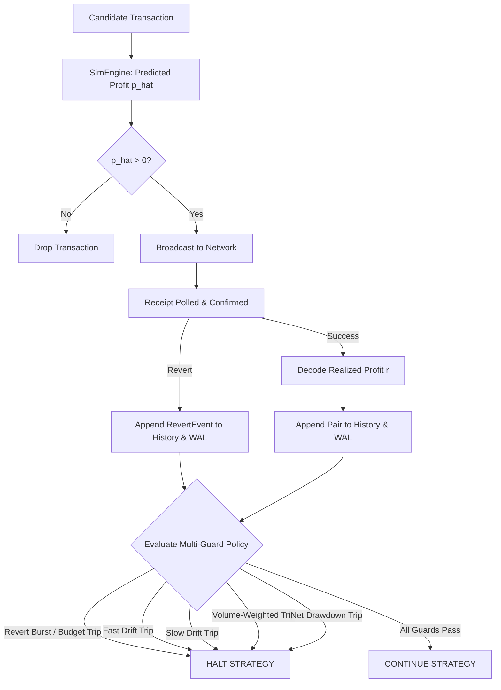

# Driftbrake: A Reconciliation-Based Halt Mechanism for Simulation-Driven Trading Strategies v0.2

**Date:** 2026-10-09  
**Author(s):** Driftbrake Project

> **Note on math rendering.** This document uses LaTeX-style notation (`$...$` inline, `$$...$$` display). GitHub renders math formulas natively; rendered views are also deployed to the project's documentation portal. All formulas include accompanying plain-text specifications and worked numerical examples.

---

## Abstract

Automated trading strategies that execute based on an internal simulation—a local REVM fork, a mempool ordering heuristic, or an off-chain oracle model—face a structural operational risk: simulation drift. Over time, execution conditions diverge from simulated assumptions due to state contention, toxic flow, or stale pricing, leading strategies to execute trades that systematically underperform expectations or revert on-chain. Because individual executions appear unremarkable in isolation, drift often evades static alert thresholds and silently compounds into real capital loss. This paper specifies Driftbrake: an institutional reconciliation framework composed of five statistical and accounting guards that continuously evaluate the relationship between predicted profit, realized profit, and on-chain execution friction. We establish formal invariants for ratio-direction correctness, guard non-redundancy, and crash resilience via Write-Ahead Logging (WAL). Finally, we demonstrate parameter-tuning methodology via empirical false-halt versus missed-catch optimization.

---

## 1. Motivation and Background

High-frequency algorithmic trading strategies on EVM networks (MEV searchers, atomic arbitrageurs, liquidation bots) operate on a simulate-then-submit paradigm:

1. **State Forking**: The bot forks state at pending block $N$ and evaluates candidate transactions locally.
2. **Profit Estimation**: If local execution yields $\hat{p} > 0$, the transaction is signed and broadcast.
3. **Execution**: The transaction confirms on-chain, realizing net profit $r$.

This paradigm introduces three failure modes independent of strategy correctness:

- **State Advancing (Latency Drift)**: State transitions occurring between local fork creation and block inclusion render simulated profit obsolete.
- **Adverse Execution Ordering**: Miner/validator bundle reorganization or private order-flow front-running degrades realized fill prices.
- **Model Desynchronization**: Stale RPC nodes or discrepancies in local EVM implementations (e.g. storage gas calculation nuances) yield systematically incorrect simulations.

Existing tooling optimizes forward simulation speed (e.g. in-process REVM forks) but lacks backward reconciliation verification. A strategy with sub-millisecond simulation will continuously bleed capital if no mechanism monitors the divergence between simulated predictions and realized outcomes.

Ad hoc safeguards—such as hardcoded consecutive loss rules—fail to address both acute execution shocks and insidious slow drift simultaneously. A robust risk engine requires independent, mathematically verifiable guards operating across distinct temporal and capital dimensions.

---

## 2. Design Overview

Driftbrake decouples strategy execution logic from risk enforcement via a pipeline of discrete accounting stages:

1. **Pre-flight Simulation**: A candidate transaction is simulated via `SimEngine`, returning predicted profit $\hat{p}$.
2. **On-chain Submission & Confirmation**: The transaction confirms. `RealizedProfitDecoder` extracts realized profit $r$ net of gas costs.
3. **History Ingestion**: Chronological entries (successful trades and on-chain reverts) are appended to `ReconcileHistory` and persisted to a binary Write-Ahead Log (WAL).
4. **Multi-Guard Evaluation**: Five independent guards evaluate the updated history:
   - **Revert-Burst Guard**: Detects rapid consecutive on-chain reverts or cumulative revert gas burn.
   - **Fast Drift Guard**: Detects sudden acute degradation in realized-to-predicted ratios over a short window.
   - **Slow Drift Guard**: Detects creeping underperformance across a rolling window.
   - **Volume-Weighted Drift Guard (VWAR)**: Weights drift by capital magnitude to prevent small trades from masking large losses.
   - **Net Drawdown Guard**: Monitors absolute capital depletion against high-watermark profit.
5. **Circuit Breaking**: If any guard triggers, execution halts immediately.

```mermaid
flowchart TD
    A[Candidate Transaction] --> B[SimEngine: Predicted Profit p_hat]
    B --> C{p_hat > 0?}
    C -->|No| D[Drop Transaction]
    C -->|Yes| E[Broadcast to Network]
    E --> F[Receipt Polled & Confirmed]
    F -->|Revert| G[Append RevertEvent to History & WAL]
    F -->|Success| H[Decode Realized Profit r]
    H --> I[Append Pair to History & WAL]
    G --> J{Evaluate Multi-Guard Policy}
    I --> J
    J -->|Revert Burst / Budget Trip| K[HALT STRATEGY]
    J -->|Fast Drift Trip| K
    J -->|Slow Drift Trip| K
    J -->|Volume-Weighted Trip| K
    J -->|Net Drawdown Trip| K
    J -->|All Guards Pass| L[CONTINUE STRATEGY]
```

---

## 3. Notation

| Symbol | Definition | Dimension / Units | Default |
|---|---|---|---|
| $\hat{p}_i$ | Predicted profit for transaction $i$ | Native currency (wei) | — |
| $r_i$ | Realized profit for transaction $i$, net of gas | Native currency (wei) | — |
| $\rho_i$ | Realized-to-predicted ratio ($r_i / \hat{p}_i$) | Dimensionless ($[0, \infty)$) | — |
| $T_f$ | Fast guard ratio threshold | Dimensionless | $0.50$ |
| $k_f$ | Fast guard window size | Integer count | $3$ |
| $T_s$ | Slow guard mean ratio threshold | Dimensionless | $0.70$ |
| $k_s$ | Slow guard rolling window size | Integer count | $20$ |
| $N_{\text{rev}}$ | Maximum consecutive on-chain reverts | Integer count | $3$ |
| $G_{\text{max}}$ | Maximum cumulative revert gas budget | Gas units | $500,000$ |
| $T_v$ | Volume-weighted ratio threshold | Dimensionless | $0.65$ |
| $k_v$ | Volume-weighted rolling window size | Integer count | $15$ |
| $D_{\text{max}}$ | Maximum allowable net capital drawdown | Native currency (wei) | $\infty$ (disabled) |
| $H_n$ | History timeline containing $n$ total entries | Sequence of events | — |

---

## 4. Mechanism Specification

### 4.1 Per-Transaction Ratio

For each confirmed transaction $i$ with $\hat{p}_i > 0$:

$$\rho_i = \frac{r_i}{\hat{p}_i} \tag{1}$$

Values of $\rho_i < 1.0$ indicate underperformance; $\rho_i \ge 1.0$ indicates execution equal to or exceeding expectation. Division direction is an inviolable invariant (Property 1).

**Worked Example.** A transaction simulated $\hat{p}_i = 100{,}000\text{ wei}$ and realized $r_i = 42{,}000\text{ wei}$ net of gas.  
$$\rho_i = \frac{42{,}000}{100{,}000} = 0.42$$  
Because $0.42 < 0.50$, transaction $i$ is flagged as an underperforming event.

Transactions with $\hat{p}_i \le 0$ are excluded from ratio computation to eliminate undefined division and prevent skewing rolling metrics.

---

### 4.2 Fast Guard (Acute Drift)

The fast guard trips if $k_f$ consecutive transactions fall below ratio threshold $T_f$:

$$\text{FastHalt}(H_n) = \begin{cases} 
\text{true} & \text{if } \forall j \in \{n - k_f + 1, \dots, n\}, \, \rho_j < T_f \\ 
\text{false} & \text{otherwise} 
\end{cases} \tag{2}$$

**Worked Example.** Given $T_f = 0.50$ and $k_f = 3$, let recent ratios be $[0.95, 0.90, 0.42, 0.38, 0.25]$.  
The last three ratios all satisfy $\rho < 0.50$. `FastHalt` returns `true`, triggering immediate strategy shutdown.

---

### 4.3 Slow Guard (Creeping Drift)

The slow guard monitors rolling average performance across a wider window $k_s$:

$$\text{SlowHalt}(H_n) = \begin{cases} 
\text{true} & \text{if } \frac{1}{k_s} \sum_{j=n-k_s+1}^{n} \rho_j < T_s \\ 
\text{false} & \text{otherwise} 
\end{cases} \tag{3}$$

**Worked Example.** With $T_s = 0.70$ and $k_s = 20$, assume 20 consecutive trades oscillate between $0.65$ and $0.72$ with a mean of $0.68$.  
No single trade triggered the fast guard ($\rho > 0.50$), yet `SlowHalt` returns `true` because $0.68 < 0.70$, preventing long-term capital attrition.

---

### 4.4 Revert-Burst and Gas Budget Guards

On-chain reverts consume priority gas without generating revenue. Driftbrake isolates reverts from the ratio pool and evaluates them via dedicated operational guards:

1. **Consecutive Revert Burst**:
$$\text{RevertBurstHalt}(H_n) = \begin{cases}
\text{true} & \text{if } \text{consecutive\_reverts}(H_n) \ge N_{\text{rev}} \\
\text{false} & \text{otherwise}
\end{cases} \tag{4}$$

2. **Revert Gas Burn Budget**:
$$\text{RevertGasHalt}(H_n) = \begin{cases}
\text{true} & \text{if } \sum_{j \in \text{recent\_reverts}(k)} \text{gas\_used}_j > G_{\text{max}} \\
\text{false} & \text{otherwise}
\end{cases} \tag{5}$$

**Worked Example.** A bot encounters 3 consecutive on-chain reverts with gas costs $[120{,}000, 150{,}000, 240{,}000]$.  
If $N_{\text{rev}} = 3$, `RevertBurstHalt` triggers immediately. Even if $N_{\text{rev}} = 5$, total gas burned equals $510{,}000 > 500{,}000$, tripping `RevertGasHalt`.

---

### 4.5 Volume-Weighted Drift Guard (VWAR)

Unweighted ratios $\rho_i$ treat small transactions identically to large transactions. An adversary or market shift could yield ten small trades overperforming by $10\%$ alongside one large trade underperforming by $80\%$, masking severe losses under a simple arithmetic mean.

Driftbrake defines the Volume-Weighted Average Ratio (VWAR):

$$\rho_{\text{VWAR}}(k_v) = \frac{\sum_{j=n-k_v+1}^n r_j}{\sum_{j=n-k_v+1}^n \hat{p}_j} \tag{6}$$

$$\text{VolumeWeightedHalt}(H_n) = \begin{cases}
\text{true} & \text{if } \rho_{\text{VWAR}}(k_v) < T_v \\
\text{false} & \text{otherwise}
\end{cases} \tag{7}$$

**Worked Example.** Consider two trades:
- Trade 1: $\hat{p}_1 = 1{,}000\text{ wei}$, $r_1 = 1{,}200\text{ wei}$ ($\rho_1 = 1.20$)
- Trade 2: $\hat{p}_2 = 1{,}000{,}000\text{ wei}$, $r_2 = 400{,}000\text{ wei}$ ($\rho_2 = 0.40$)

Arithmetic mean: $(1.20 + 0.40) / 2 = 0.80$ (passes a $0.70$ threshold).  
Volume-weighted ratio:
$$\rho_{\text{VWAR}} = \frac{1{,}200 + 400{,}000}{1{,}000 + 1{,}000{,}000} \approx 0.4008$$
At $T_v = 0.65$, `VolumeWeightedHalt` triggers, preventing whale mispricing from passing unnoticed.

---

### 4.6 Net Drawdown Guard

The drawdown guard tracks cumulative strategy profit $P_n = \sum_{j=1}^n r_j$ and peak profit $M_n = \max_{0 \le t \le n} P_t$:

$$\Delta_n = M_n - P_n \tag{8}$$

$$\text{DrawdownHalt}(H_n) = \begin{cases}
\text{true} & \text{if } \Delta_n > D_{\text{max}} \\
\text{false} & \text{otherwise}
\end{cases} \tag{9}$$

---

### 4.7 Multi-Guard Evaluation Hierarchy

Driftbrake evaluates guards in order of increasing computational complexity and urgency:

$$\text{Halt}(H_n) = \text{RevertBurst} \lor \text{RevertGas} \lor \text{FastHalt} \lor \text{SlowHalt} \lor \text{VWAR} \lor \text{Drawdown} \tag{10}$$

Evaluation short-circuits on the first tripped guard, emitting a structured `HaltReason` for automated reconciliation.

---

### 4.8 Receipt-Gated Realization

Profit is booked if and only if:
1. Transaction receipt status is confirmed (`status == 1`).
2. An event log matching `RealizedProfitDecoder` is present and decodable.

Reverted receipts never enter the ratio pool; they are ingested into revert accounting. Unconfirmed or pending receipts are never evaluated.

---

### 4.9 Crash-Resilient State Persistence (WAL)

To prevent risk state loss across process restarts, `ReconcileHistory` is backed by an append-only binary Write-Ahead Log (`driftbrake-journal`):

- **Header**: 16-byte fixed header (`b"DRFT"`, format version 1, flags).
- **Framing**: Length-prefixed records containing payload and IEEE 802.3 CRC32 checksums.
- **Torn-Write Recovery**: During restart recovery, any incomplete or corrupt trailing bytes are detected via CRC mismatch and automatically truncated to the last valid frame.
- **Concurrency**: Process-level advisory locks prevent multi-instance write conflicts.

---

## 5. Formal Invariants

**Property 1 (Ratio-Direction Invariance).**  
For any transaction $i$ with $\hat{p}_i > 0$, the ratio is strictly defined as $\rho_i = r_i / \hat{p}_i$. The inverse $\hat{p}_i / r_i$ maps underperformance to values $> 1$ and overperformance to $< 1$. This would invert guard inequalities and cause strategies to halt on unexpected windfalls while failing to catch actual losses. Property 1 is enforced via deterministic regression tests in `driftbrake-reconcile`.

**Property 2 (Guard Orthogonality).**  
The fast guard and slow guard are non-redundant. Let $T_f < T_s$. There exists a history $H_A$ where $\text{FastHalt}(H_A) = \text{false}$ and $\text{SlowHalt}(H_A) = \text{true}$ (gradual decay). There exists a history $H_B$ where $\text{FastHalt}(H_B) = \text{true}$ and $\text{SlowHalt}(H_B) = \text{false}$ (sudden drop after high historical profits). Removing either guard strictly degrades error detection.

**Property 3 (Fast Guard Monotonicity).**  
Holding history $H_n$ constant, the fast guard decision is monotonic with respect to threshold:  
$$T_f^{(1)} \le T_f^{(2)} \implies \text{FastHalt}_{T_f^{(1)}}(H_n) \le \text{FastHalt}_{T_f^{(2)}}(H_n)$$  
Increasing $T_f$ monotonically increases sensitivity, strictly bounding false-halt versus missed-catch optimization.

**Property 4 (Zero-Division Immunity).**  
For all transactions with $\hat{p}_i \le 0$, ratio calculation is bypassed. Evaluation over an empty or insufficient history ($n < k_f$) deterministically returns `HaltDecision::Continue`. No guard evaluation can produce a runtime panic or `NaN`.

**Property 5 (Revert Separation).**  
Revert events update revert counters and gas burn tracking but never modify ratio history $H_n$. A reverted transaction cannot skew moving average ratios.

**Property 6 (WAL Recovery Invariance).**  
Given a log containing $m$ valid frames and a trailing torn write of length $b > 0$, recovery yields an identical history state to a clean log containing $m$ frames, with the underlying file truncated to size $\sum_{j=1}^m \text{len}(\text{frame}_j) + 16$.

---

## 6. Security Considerations

| Risk Vector | Attack Scenario | Mitigation |
|---|---|---|
| **Slow-Bleed Poisoning** | Adversary manipulates price pools to keep trades just above $T_f$ while steadily bleeding capital | Slow guard ($T_s$) and Volume-Weighted guard ($T_v$) aggregate rolling underperformance and trip the circuit breaker |
| **Whale Masking** | Strategy executes many small profitable trades alongside one massive loss | Volume-Weighted Average Ratio (VWAR) weights by capital volume, preventing small-trade masking |
| **Revert Flooding** | Adversary front-runs transactions, causing consecutive reverts and burning priority gas | Revert-Burst ($N_{\text{rev}}$) and Revert-Gas Budget ($G_{\text{max}}$) guards halt strategy before gas drain compounds |
| **Process Restart Exploitation** | Strategy crashes or restarts, clearing in-memory history and resetting guard windows | `JournaledHistory` replays state from binary WAL on startup, preserving consecutive revert counts and ratios |
| **Zero / Negative Spoofing** | Adversary or corrupted RPC produces zero or negative predicted profit | Guard policy excludes $\hat{p} \le 0$ from ratio pool, logging distinct simulation anomalies |
| **RPC Thread Starvation** | Synchronous simulation blocks executor threads, delaying halt evaluation | `SimEngine` executes in dedicated `spawn_blocking` pools with bounded semaphores |

---

## 7. Parameters

| Parameter | Symbol | Default Value | Tuning Guidance |
|---|---|---|---|
| Fast Guard Threshold | $T_f$ | $0.50$ | Decrease on volatile venues; increase on stable pairs |
| Fast Guard Window | $k_f$ | $3$ | 3 consecutive failures represents strong acute signal |
| Slow Guard Threshold | $T_s$ | $0.70$ | Set to minimum acceptable strategy realization margin |
| Slow Guard Window | $k_s$ | $20$ | Balance sample significance against detection lag |
| Max Consecutive Reverts | $N_{\text{rev}}$ | $3$ | Bound against toxic flow or competitive front-running |
| Revert Gas Budget | $G_{\text{max}}$ | $500{,}000\text{ gas}$ | Bound total non-productive gas burn per window |
| Volume-Weighted Threshold | $T_v$ | $0.65$ | Protect capital sizing across asymmetric trade sizes |
| Volume-Weighted Window | $k_v$ | $15$ | Rolling trade horizon for capital weighting |
| Net Drawdown Threshold | $D_{\text{max}}$ | Disabled ($\infty$) | Absolute stop-loss buffer from portfolio peak |

---

## 8. Comparison to Prior Work

| Capability | Standard Sim Tooling (e.g. raw REVM) | Ad-Hoc Scripts | Driftbrake v0.2 |
|---|---|---|---|
| In-Process Transaction Simulation | Yes | Yes | Yes (via `SimEngine`) |
| Chain-Agnostic Profit Decoding | No | No | Yes (`ProfitDecoder`) |
| Acute Drift Detection | No | Single heuristic | Yes (Fast Guard) |
| Creeping Bleed Detection | No | No | Yes (Slow Guard) |
| Capital-Weighted Drift (VWAR) | No | No | Yes |
| Dedicated Revert-Burst & Gas Guard | No | No | Yes |
| Crash-Resilient WAL Persistence | No | No | Yes (`driftbrake-journal`) |
| Compiled Python Backtesting Engine | No | No | Yes (`driftbrake-py`) |
| Ratio Invariant Formal Proofs | No | No | Yes (Properties 1–6) |

---

## 9. Conclusion

Driftbrake delivers an institutional-grade risk engine for automated EVM trading strategies. By monitoring the empirical divergence between simulated pre-flight estimates and realized on-chain execution, Driftbrake closes the critical verification loop left open by forward-only simulation engines. Through five orthogonal guards, binary Write-Ahead Log persistence, and compiled Python bindings, Driftbrake prevents simulation drift from compounding into catastrophic capital loss.

---

## 10. References

1. REVM: Rust Ethereum Virtual Machine. https://github.com/bluealloy/revm
2. Tokio Async Runtime: `spawn_blocking` and resource isolation. https://tokio.rs
3. IEEE 802.3: Carrier Sense Multiple Access with Collision Detection (CRC32 Specification).
4. CPython Stable ABI: PEP 384 — Defining a Stable Application Binary Interface.
